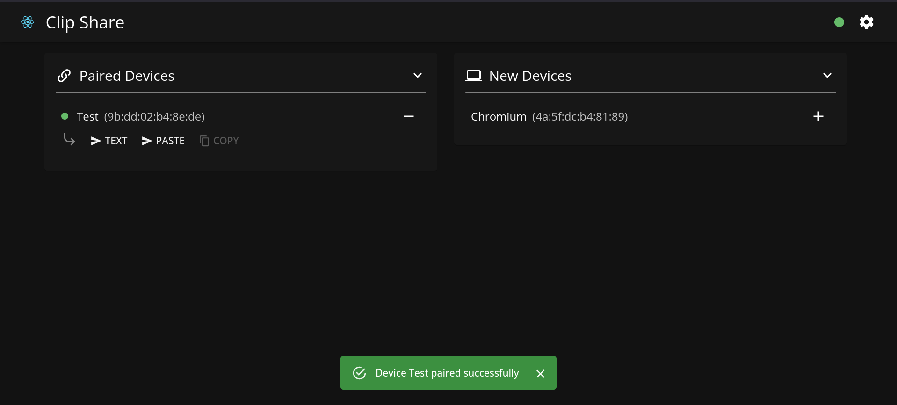

# clip-share

[](https://hub.docker.com/r/dcsunset/clip-share-server)
[](https://github.com/DCsunset/clip-share)

Self-hosted service to share clipboard content with other devices.

## Screenshots



## Server

### Usage

Run the docker image for server:

```sh
docker run -it -p 3000:3000 dcsunset/clip-share-server
```

Or you can build and run the repo from source:

```sh
cd server
npm run build
npm start
```

The server listens at `http://0.0.0.0:3000` by default in production mode.
The address and port to bind can be changed using environment variables `ADDR` and `PORT`.


## Web UI

### Usage

Pre-built files can be found in GitHub releases.

Or you can build and run the repo from source:

```sh
cd webui
npm run build
# server the static content with any http server
http-server ./dist
```


### Trouble shooting

To make `paste` and `autoCopy` work.
currently for Firefox (v101),
`dom.events.testing.asyncClipboard` must be enabled in `about:config`.

For chromium-based browsers,
a dialog will be prompted to ask for clipboard permission automatically.

## License

AGPL-3.0 License.

Copyright notice:

```
Copyright (C) 2022  DCsunset

This program is free software: you can redistribute it and/or modify
it under the terms of the GNU Affero General Public License as published by
the Free Software Foundation, either version 3 of the License, or
(at your option) any later version.

This program is distributed in the hope that it will be useful,
but WITHOUT ANY WARRANTY; without even the implied warranty of
MERCHANTABILITY or FITNESS FOR A PARTICULAR PURPOSE.  See the
GNU Affero General Public License for more details.

You should have received a copy of the GNU Affero General Public License
along with this program.  If not, see <https://www.gnu.org/licenses/>.
```

